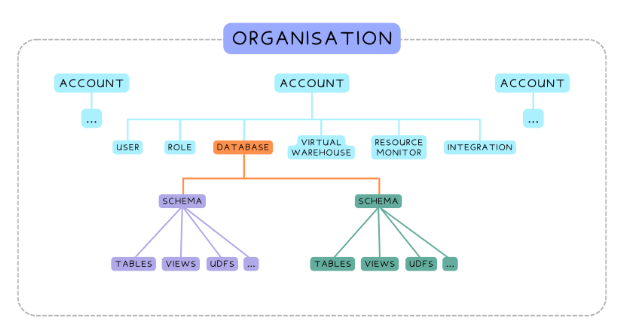
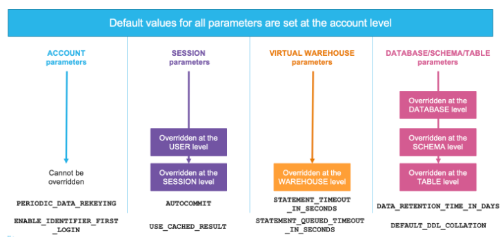
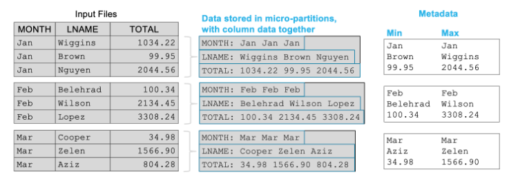
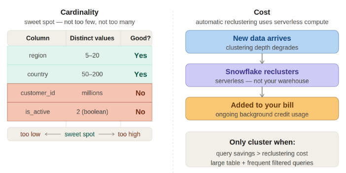
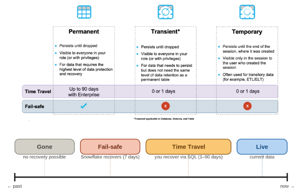
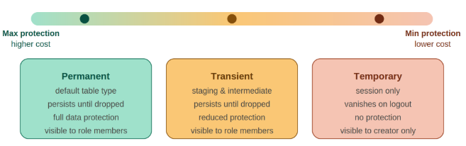
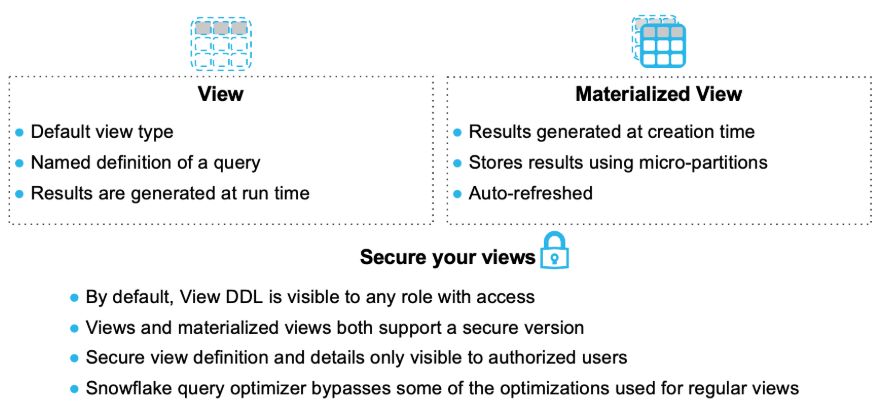

# Snowflake

Snowflake is a cloud-based column-based storage data warehouse that runs on AWS, Azure, and Google Cloud. It's a fully managed service that separates compute and storage, so you only pay for what you use. It automatically scales to handle large datasets and delivers fast SQL query performance. It's popular for analytics, business intelligence, and data pipelines, and features unique data-sharing capabilities that let you securely share data across organizations without copying. Excellent for data analytics.

## Object hierarchy

  

Session variables let you store and reuse values within a script. Set one with the SET function, for example, SET min_users = 100 then reference it anywhere in that session using dollar sign min_users.

Account parameters sit at the top and can't be overridden. Whatever is set at the account level is what applies, things like PERIODIC_DATA_REKEYING.

Session parameters work differently. The account sets a default, an administrator can override it for a specific user, and the user can override it again within their active session. The lowest level at which the parameter is set wins.

Virtual warehouse parameters follow a simpler two-level chain: account default, then overridden at the warehouse itself. STATEMENT_TIMEOUT_IN_SECONDS is the classic one — you might want a tighter timeout on your dashboard warehouse than the account default allows.

Finally, database, schema, and table parameters cascade down through the object hierarchy. Set a default at the account level, override it at the database, narrow it further at the schema, and override it again on a specific table. DATA_RETENTION_TIME_IN_DAYS works this way, your account might default to one day, but your more important billing tables get thirty. The rule across all four types is the same: the lowest level at which the parameter is set will be used, and that value wins.

  

## Micro partitioning and pruning

When data is loaded into Snowflake, it automatically gets divided into micro-partitions, which are chunks of on-disk storage on the order of 50 to 500 MB of uncompressed data. For every micro-partition that Snowflake creates it stores metadata including min and max value for each column, the row count, null counts and distinct value counts. This metadata is stored in the cloud services layer and is maintained automatically as data is loaded and updated.

Pruning only works well when the column you are trying to filter on is well-clustered, meaning that the rows with similar values are grouped together in the same micro-partitions.

  

Clustering is like an index in traditional databases like postgres.

A clustering key makes sense when three things are true: the table is large enough that pruning actually matters, 100Gb or bigger tables, you're consistently filtering on the same column; and that column is poorly clustered, meaning pruning isn't working for it.

  

## Table Types and Views

  

  

  

**Time Travel** is like a version control within snowflake. Time Travel lets you query data as it existed at any point within the retention window. In standard edition you only have 1 day of data retention, while in enterprise you have up to 90 days.

**Fail-safe** is an additional layer of protection. Beyond the Time Travel window, Snowflake automatically holds your data for a further seven days in Fail-safe. You can't query it yourself during that period, but if you need it, Snowflake Support can recover it for you. This is your last resort. 

## Security and Access Control
RBAC: Role Based Access Control, Privileges, such as SELECT, INSERT, etc are granted to roles (analyst_role), which are assigned to users (some_email). Never assign privileges to users, don't skip the role step.

ACCOUNTADMIN for account-level administration, SECURITYADMIN for the security landscape, and SYSADMIN for data infrastructure.

Three grants are required to give the a role access to a table: USAGE on the database, USAGE on the schema, and SELECT on the table. The most common mistake is granting SELECT and forgetting the USAGE grants.The hierarchy enforces that every level of access is deliberate.

There is an additional level of security available, column-based security, this approach uses a masking policy to show the column with the values are masked. 

## Functions

GET_PRESIGNED_URL() generates a time-limited download link that requires no Snowflake credentials. This link can be shared with anyone so they can download the data: 
`SELECT GET_PRESIGNED_URL(@my_stage, 'file_name.json', 3600)`

## Snowflake Query Execution Order

| Order | Clause | Purpose |
|-------|--------|---------|
| 1 | FROM | Identifies the source table(s) to query from |
| 2 | WHERE | Filters rows based on specified conditions before grouping |
| 3 | GROUP BY | Groups rows into subsets based on specified columns |
| 4 | HAVING | Filters groups based on aggregate function conditions |
| 5 | SELECT | Selects which columns and expressions to return |
| 6 | Window Functions | Computes values over a set of rows (ROW_NUMBER, RANK, LAG, LEAD, etc.) |
| 7 | QUALIFY | Filters rows based on window function results |
| 8 | DISTINCT | Removes duplicate rows from results |
| 9 | ORDER BY | Sorts the result set in ascending or descending order |
| 10 | LIMIT | Restricts the number of rows returned |

- **Window Functions** are calculated after SELECT but before ORDER BY
- **QUALIFY** is used to filter results based on window function conditions.

## Snowflake Query Best Practices

### Column Selection
- **Avoid SELECT *** – Always specify only the columns you need to reduce data transfer and improve performance
- **Select relevant columns** – Unnecessary columns increase I/O and processing time
- **Use column aliases** – Make queries more readable and maintainable

### WHERE Clauses & Filtering
- **Add WHERE clauses early** – Filter data as early as possible to reduce the dataset size
- **Avoid functions in WHERE clauses** – Functions prevent partition pruning and index usage (e.g., `WHERE YEAR(date_col) = 2024` is slower than `WHERE date_col >= '2024-01-01'`)
- **Use BETWEEN instead of OR** – `BETWEEN` is more efficient than multiple OR conditions
- **Filter on clustered/partitioned columns** – Takes advantage of Snowflake's clustering and micro-partitioning
- **Avoid NOT IN with NULL values** – Can return unexpected results; use NOT EXISTS instead

### Query Optimization
- **Use LIMIT clauses** – Restrict result sets when exploring data or for pagination
- **Use CTEs (Common Table Expressions)** – Improves readability and allows query optimization
- **Avoid correlated subqueries** – They execute repeatedly; use JOINs or window functions instead
- **Use EXPLAIN PLAN** – Analyze query execution before running large queries
- **Avoid multiple passes** – Consolidate logic to avoid scanning tables multiple times

### Joins & Relationships
- **Use appropriate JOIN types** – Only use INNER, LEFT, RIGHT, or FULL as needed
- **Join on indexed/clustered columns** – Improves join performance
- **Avoid self-joins when possible** – Use window functions as an alternative
- **Filter before joining** – Reduce dataset size before performing joins

### Aggregations
- **Use GROUP BY efficiently** – Group by necessary columns only
- **Use HAVING to filter aggregates** – Not WHERE; HAVING applies after grouping
- **Avoid GROUP BY on non-aggregated columns** – Increases processing unnecessarily
- **Use QUALIFY for window functions** – Instead of subqueries to filter window function results

### Data Types & Casting
- **Use appropriate data types** – Don't store numbers as strings or vice versa
- **Avoid unnecessary casting** – Casting can prevent partition pruning
- **Use CAST or :: for conversions** – Only when necessary; keep data types consistent

### Performance & Cost
- **Monitor query cost** – Use QUERY_HISTORY to track and optimize expensive queries
- **Use approximate functions** – `APPROX_PERCENTILE()`, `APPROX_COUNT_DISTINCT()` for large datasets when precision isn't critical
- **Leverage caching** – Identical queries within 24 hours use cached results
- **Materialize views** – Create materialized views for frequently accessed aggregations
- **Avoid SELECT in subqueries unnecessarily** – Push aggregations down to reduce rows

### Code Quality
- **Use meaningful aliases** – Make queries self-documenting
- **Format queries consistently** – Use proper indentation and line breaks
- **Comment complex logic** – Explain the "why" behind complex calculations
- **Test on smaller datasets first** – Avoid running expensive queries on entire tables

### Snowflake-Specific
- **Use QUALIFY clause** – Simplifies filtering on window functions (Snowflake feature)
- **Leverage zero-copy cloning** – For testing without data duplication
- **Use dynamic SQL sparingly** – Stored procedures with dynamic SQL can be harder to optimize
- **Consider semi-structured data** – Use VARIANT type efficiently for JSON/nested data

### Anti-Patterns to Avoid
- ❌ SELECT * without specific column needs
- ❌ Functions in WHERE clauses
- ❌ NOT IN with subqueries returning NULL
- ❌ Correlated subqueries
- ❌ Excessive OR conditions
- ❌ Querying without LIMIT during exploration
- ❌ Joining before filtering
- ❌ Ignoring query execution plans
